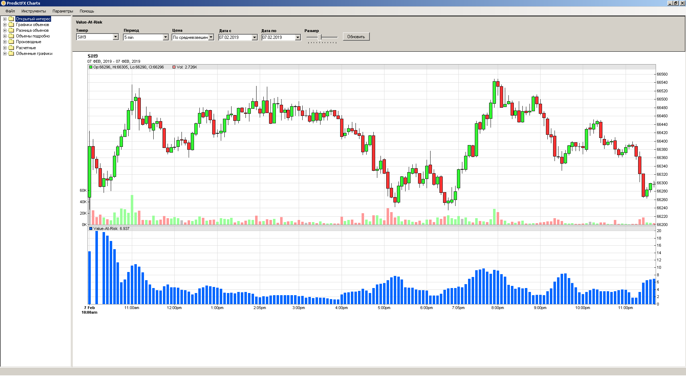

# PredictFXCharts
PredictFX Биржевые Графики

База для разработки и запуска торговых стратегий на C# (СИ-шарп - язык программирования), готовые биржевые роботы уже встроены, все в исходном коде и бесплатно. Обмен данными с Торговым Терминалом Quik по DDE.

